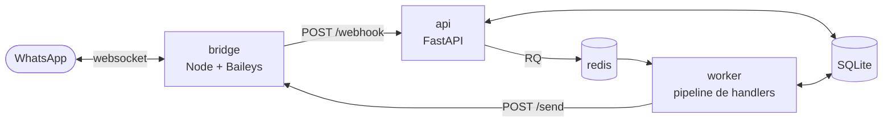

# frilivin-whatsapp-bot

Bot WhatsApp **auto-hébergé**, en **Docker Compose**, conçu pour tourner sur un petit
VPS **Ubuntu** — Hetzner Cloud (~4 €/mois) ou Oracle Cloud Free Tier (gratuit mais
souvent en rupture de capacité). Les images sont multi-arch : **arm64 comme amd64**.

Un compte WhatsApp dédié reçoit les messages, un pipeline de handlers Python décide
quoi en faire, et le bot répond ou relaie vers des groupes.

- **~300 messages entrants/jour**, traitement **< 2 s** par message
- **Aucun service payant** : pas d'API WhatsApp Business, pas de cloud managé
- **Extensible** : ajouter un comportement = déposer un fichier dans `processing/handlers/`

---

## Table des matières

1. [Architecture](#architecture)
2. [Arborescence](#arborescence)
3. [Déploiement sur un VPS Ubuntu ARM64](#déploiement-sur-un-vps-ubuntu-arm64)
4. [Scanner le QR code](#scanner-le-qr-code)
5. [Trouver les JID des groupes](#trouver-les-jid-des-groupes)
6. [Diffuser une liste avec `!envoi`](#diffuser-une-liste-avec-envoi)
7. [Écrire à des groupes avec `!envoigroupe`](#écrire-à-des-groupes-avec-envoigroupe)
8. [Générer un import Sage 50](#générer-un-import-sage-50)
9. [Ajouter un comportement](#ajouter-un-comportement)
10. [Configuration](#configuration)
11. [Exploitation](#exploitation)
12. [Développement et tests](#développement-et-tests)
13. [Dépannage](#dépannage)
14. [Limites connues](#limites-connues)

---

## Architecture

Quatre conteneurs, un seul réseau Docker privé. Rien n'est exposé publiquement.



**Chemin d'un message entrant**

1. `bridge` reçoit le message, en extrait `{id, from, chat_jid, is_group, timestamp, type,
   text, quoted_id}` et le POST à `api:8000/webhook`.
2. `api` valide, **déduplique sur `id`** (clé primaire SQLite), enfile dans Redis et
   répond `200` immédiatement. Aucun traitement synchrone, jamais.
3. `worker` dépile et exécute la chaîne de handlers, triée par `priority`, en s'arrêtant
   si l'un d'eux a `stop_propagation = True`.
4. Un handler qui veut répondre renvoie des `Outbound` ; le worker les passe au limiteur
   de débit, les écrit en base, puis appelle `bridge POST /send`.

**Chemin d'un message sortant**

`POST /send` répond **`202` immédiatement** et empile le message dans une file persistée
sur disque. C'est le bridge qui applique ensuite le délai aléatoire de **2 à 8 secondes**
avant l'envoi réel, puis rappelle l'api pour inscrire le statut final en base.

> Pourquoi ce découpage : le worker a un budget de **2 s par message**. S'il attendait le
> délai anti-spam, chaque envoi ferait exploser ce budget. Le délai appartient au
> transport, pas au traitement.

---

## Arborescence

```
.
├── docker-compose.yml          # redis + api + worker + bridge
├── .env.example                # toute la configuration, commentée
├── Makefile                    # raccourcis d'exploitation (make help)
├── bridge/                     # Node.js — transport WhatsApp
│   └── src/
│       ├── index.js            # démarrage et câblage
│       ├── wa.js               # socket Baileys, QR, reconnexion
│       ├── extract.js          # message WhatsApp → payload webhook (pur, testé)
│       ├── outbox.js           # file d'envoi persistée + délai 2-8 s
│       ├── quoted-cache.js     # LRU id → message, pour citer une réponse
│       ├── http.js             # /send /groups /health
│       └── api-client.js       # appels vers l'api, avec tampon de secours
└── app/                        # Python — api et worker (même image)
    ├── whatsapp_bot/
    │   ├── config.py           # réglages (pydantic-settings)
    │   ├── db.py               # schéma SQLite, déduplication, journal
    │   ├── ratelimit.py        # 500/jour et 30/minute, atomique (Lua)
    │   ├── sending.py          # LiveSender : l'unique chemin de sortie
    │   ├── groups.py           # liste des groupes en cache + recherche par fragments
    │   ├── api/main.py         # POST /webhook, GET /health, GET /groups
    │   ├── worker/
    │   │   ├── main.py         # boucle RQ + dead-letter queue
    │   │   └── tasks.py        # le job et l'exécution du pipeline
    │   └── processing/
    │       ├── base.py         # ABC Handler + Context
    │       ├── registry.py     # découverte automatique, tri par priority
    │       └── handlers/       # ← vos comportements vont ici
    └── tests/                  # pytest
```

---

## Déploiement sur un VPS Ubuntu ARM64

Les étapes 2 à 6 sont identiques quel que soit l'hébergeur. Seule la création de
l'instance change.

### 1. Créer l'instance

#### Option A — Hetzner Cloud CAX11 *(recommandé)*

Le meilleur rapport prix/adéquation : ARM64 natif, 4 Go de RAM, disponible
immédiatement. Comptez ~3,80 €/mois pour le serveur et ~0,60 €/mois pour l'IPv4
(tarifs à vérifier au moment de la commande).

Une fois le compte créé et le moyen de paiement enregistré, dans `console.hetzner.com` :

1. **New project** (par exemple `whatsapp-bot`), puis ouvrez-le.
2. Onglet **Security ▸ SSH keys ▸ Add SSH key** : collez votre clé publique
   (`cat ~/.ssh/id_ed25519.pub` ; si vous n'en avez pas, créez-la avec
   `ssh-keygen -t ed25519`). L'ajouter *avant* le serveur évite de recevoir un mot de
   passe root par e-mail.
3. **Servers ▸ Add Server**.

| Réglage | Valeur |
| --- | --- |
| Location | **Falkenstein**, Nuremberg ou Helsinki |
| Image | **Ubuntu 24.04** |
| Type | onglet **Arm64** → **CAX11** ; si l'ARM est en rupture, un **CX** x86 fait tout aussi bien (voir ci-dessous) |
| Networking | **IPv4 + IPv6** (décocher IPv4 économise ~0,60 €/mois, mais impose un accès SSH en IPv6) |
| SSH keys | cochez la clé ajoutée à l'étape 2 |
| Firewalls | **Create firewall** → une seule règle entrante : **TCP 22**, idéalement limitée à votre IP |
| Backups | facultatif (+20 %) ; `make backup` couvre déjà l'essentiel |
| Name | `whatsapp-bot` |

4. **Create & Buy now**. La machine est prête en ~30 secondes et son IPv4 s'affiche
   dans la liste. La facturation est horaire : supprimer le serveur arrête les frais.

> Le pare-feu Hetzner est gratuit et s'applique **en amont de la VM**. Laissez le
> trafic sortant entièrement ouvert : le bot n'a besoin que de sortir.

> **ARM en rupture ?** La disponibilité des CAX varie selon le datacenter — essayez
> Nuremberg ou Helsinki avant de renoncer. Sinon, prenez un **CX** (x86) : aucune image
> n'est épinglée sur une architecture et les trois images de base sont multi-arch, donc
> le stack se construit et tourne à l'identique. N'importe quel modèle avec **2 Go de
> RAM ou plus** convient, le stack consommant ~350-400 Mo. L'ARM64 était un héritage de
> la cible Oracle, pas une dépendance.

L'utilisateur par défaut est `root`. Passez à l'[étape 2](#2-durcir-laccès-ssh-hetzner)
avant tout le reste.

#### Option B — Oracle Cloud Always Free (Ampere A1)

Gratuit à vie, mais la capacité A1 est fréquemment épuisée (`Out of host capacity`).
Dans la console Oracle : **Compute ▸ Instances ▸ Create instance**.

| Réglage | Valeur |
| --- | --- |
| Image | Canonical **Ubuntu 24.04** |
| Shape | **VM.Standard.A1.Flex** (Ampere, ARM64) |
| OCPU / RAM | 1 OCPU / 6 Go suffisent largement ; jusqu'à 4/24 en Always Free |
| Boot volume | 50 Go |
| Clé SSH | ajoutez votre clé publique |

> **Always Free** : la shape A1.Flex est gratuite dans la limite de 4 OCPU et 24 Go
> cumulés sur le tenancy. Vérifiez la mention « Always Free eligible » avant de valider.

> **En cas de `Out of host capacity`** : les ressources Always Free n'existent que dans
> la région d'origine du compte, changer de région ne contourne donc rien. Ne précisez
> aucun fault domain, alternez les availability domains si votre région en a plusieurs,
> et relancez la création en boucle — la capacité se libère en continu. Passer le compte
> en Pay As You Go améliore la priorité sans rendre les ressources gratuites payantes.

L'utilisateur par défaut est `ubuntu`, déjà sans mot de passe et avec sudo : l'étape 2
ne s'applique pas, passez directement à l'étape 3.

### 2. Durcir l'accès SSH (Hetzner)

Contrairement à l'image Oracle, celle de Hetzner expose `root` sur une IP publique.
Deux minutes de durcissement s'imposent.

```bash
ssh root@<IP_PUBLIQUE>

adduser --disabled-password --gecos "" bot
usermod -aG sudo bot
echo "bot ALL=(ALL) NOPASSWD:ALL" > /etc/sudoers.d/90-bot
rsync --archive --chown=bot:bot ~/.ssh /home/bot
```

Interdisez ensuite la connexion de `root` et l'authentification par mot de passe :

```bash
cat > /etc/ssh/sshd_config.d/99-hardening.conf <<'EOF'
PermitRootLogin no
PasswordAuthentication no
KbdInteractiveAuthentication no
EOF
systemctl restart ssh
```

**Sans fermer cette session**, vérifiez depuis un autre terminal que
`ssh bot@<IP_PUBLIQUE>` fonctionne — c'est votre filet de sécurité si la configuration
est erronée.

Activez enfin les mises à jour de sécurité automatiques :

```bash
sudo apt update && sudo apt install -y unattended-upgrades
sudo dpkg-reconfigure -plow unattended-upgrades
```

### 3. Se connecter

```bash
ssh bot@<IP_PUBLIQUE>      # ubuntu@... sur Oracle
```

> **Aucun port à ouvrir.** Les services n'écoutent que sur `127.0.0.1` : ni le pare-feu
> de l'hébergeur ni `iptables` n'ont besoin d'être ouverts au-delà du port 22. Pour
> interroger l'api depuis votre poste, passez par un tunnel SSH (voir
> [Exploitation](#exploitation)).

### 4. Installer Docker

```bash
curl -fsSL https://get.docker.com | sudo sh
sudo usermod -aG docker $USER
newgrp docker            # ou déconnexion/reconnexion
docker --version && docker compose version
```

Le script officiel gère nativement `linux/arm64`.

### 5. Récupérer le projet et le configurer

```bash
git clone https://github.com/JunyiLi0/frilivin-whatsapp-bot.git
cd frilivin-whatsapp-bot
cp .env.example .env
```

Générez le secret partagé entre les services et inscrivez-le dans `.env` :

```bash
sed -i "s/^BOT_TOKEN=.*/BOT_TOKEN=$(openssl rand -hex 32)/" .env
```

Relisez `.env` : chaque variable y est commentée.

### 6. Construire et démarrer

```bash
docker compose build      # ~2 min sur un CAX11, ~5 min sur 1 OCPU Oracle
docker compose up -d
docker compose ps
```

> **Sur une machine à 1 Go de RAM** (Oracle `E2.1.Micro`, GCP `e2-micro`…), le stack
> tient — il consomme ~350-400 Mo en régime normal — mais les `mem_limit` du
> `docker-compose.yml` sont dimensionnés pour une machine confortable. Divisez-les par
> deux et ajoutez du swap avant de démarrer :
>
> ```bash
> sudo fallocate -l 2G /swapfile && sudo chmod 600 /swapfile
> sudo mkswap /swapfile && sudo swapon /swapfile
> echo '/swapfile none swap sw 0 0' | sudo tee -a /etc/fstab
> ```

---

## Scanner le QR code

Au tout premier démarrage, le bridge n'a pas de session : il affiche un QR code
dans ses logs.

```bash
docker compose logs -f bridge
```

Sur le **téléphone du numéro dédié** :

**WhatsApp ▸ Réglages ▸ Appareils liés ▸ Lier un appareil**, puis scannez le QR affiché
dans le terminal.

Le QR **expire au bout d'une vingtaine de secondes** ; s'il disparaît, un nouveau est
généré automatiquement — gardez simplement les logs ouverts.

Une fois lié :

```json
{"level":"info","timestamp":"...","service":"bridge","event":"wa_connected","user":"33612345678:1@s.whatsapp.net"}
```

La session est enregistrée dans le volume `wa_session` : **le scan n'est à faire
qu'une fois**, même après un redémarrage ou une mise à jour.

Vérifiez ensuite l'état général :

```bash
make health
```

```json
{"status": "ok", "checks": {"database": "ok", "redis": "ok"}}
```

Envoyez enfin `!ping` au numéro du bot depuis un autre téléphone : vous recevez
`pong 🏓` après 2 à 8 secondes.

---

## Trouver les JID des groupes

Un JID de groupe ressemble à `120363000000000000@g.us`. Le bot ne peut écrire que dans
les groupes dont **le numéro dédié est membre**.

```bash
make groups
```

```json
{
  "count": 2,
  "groups": [
    {
      "jid": "120363000000000000@g.us",
      "subject": "Alertes techniques",
      "participants": 12,
      "numbers": ["33766660673", "33612345678"]
    }
  ]
}
```

`numbers` liste les numéros des membres que WhatsApp nous communique : c'est ce qui
permet à [`!envoigroupe`](#écrire-à-des-groupes-avec-envoigroupe) de retrouver un groupe
à partir du numéro de l'un d'eux, sans avoir à recopier son JID.

Reportez le ou les JID voulus dans `.env` :

```dotenv
RELAY_KEYWORDS=urgent,alerte
RELAY_TARGET_JIDS=120363000000000000@g.us
```

puis `docker compose up -d worker` pour recharger.

---

## Diffuser une liste avec `!envoi`

Le comportement principal du bot : **un destinataire par ligne, chacun avec son propre
message**. Vous écrivez au numéro dédié, depuis votre téléphone habituel :

```
!envoi
33766793050; Bonjour, la réunion est déplacée à 15 h
33784828374; Peux-tu confirmer ta présence ?
120363000000000000@g.us; Compte rendu envoyé par mail
nord; Message pour l'alias « nord »
```

Le bot répond en citant votre demande :

```
📤 4 message(s) en file d'envoi :
  ✅ +33766793050
  ✅ +33784828374
  ✅ 120363000000000000
  ✅ 120363000000000042

⏳ Chaque message part avec 2-8 s d'écart.
```

### Activer la commande

**Sans allowlist, le handler est désactivé** : renseignez qui a le droit de diffuser,
sinon n'importe quel inconnu écrivant au numéro disposerait d'un relais de diffusion.

```dotenv
BROADCAST_ADMIN_JIDS=33612345678,33698765432
BROADCAST_ALIASES=nord=120363000000000000@g.us,sud=120363000000000042@g.us
```

puis `docker compose up -d worker`. Un expéditeur non autorisé n'obtient **aucune
réponse** : la tentative est seulement journalisée (`broadcast_refused`).

### Format accepté

| Écriture du destinataire | Résultat |
| --- | --- |
| `33766793050`, `+33 7 66 79 30 50`, `07-66-79-30-50` | message privé |
| `120363000000000000` ou `120363000000000000@g.us` | groupe |
| `nord` | alias, résolu via `BROADCAST_ALIASES` ou la table `state` |

- Le séparateur est le **premier** `;` de la ligne : le message peut en contenir d'autres.
- Ligne vide ignorée, ligne commençant par `#` traitée comme un commentaire.
- La liste peut commencer sur la ligne de la commande (`!envoi 33766793050; Salut`).
- Une ligne illisible n'annule pas les autres : elle est listée dans l'accusé, avec son
  numéro de ligne.
- `!envoi` seul affiche un mémo d'utilisation.

### Ajouter un alias sans redémarrer

```bash
docker compose exec api python -c "
from whatsapp_bot import db
with db.session('/data/bot.db') as c:
    db.set_state(c, 'broadcast:alias:nord', '120363000000000000@g.us')"
```

Les alias de la table `state` sont prioritaires sur ceux de `.env`.

### Le plafond, et pourquoi il existe

`BROADCAST_MAX_RECIPIENTS` (défaut `25`) limite le nombre de destinataires par envoi.
**Au-delà, rien n'est envoyé** — le lot entier est refusé et l'accusé vous invite à
découper votre liste. C'est volontaire : un envoi partiel serait pire, car le rate
limiter global consomme son quota **au moment de la mise en file**, et les envois refusés
sont abandonnés avec un simple avertissement dans les logs.

Pour la même raison, le plafond est automatiquement borné à `RATE_LIMIT_PER_MINUTE - 1`
(l'accusé de réception consomme lui aussi un envoi). Si vous montez
`BROADCAST_MAX_RECIPIENTS`, montez `RATE_LIMIT_PER_MINUTE` avec — et gardez en tête que
le bridge espace les envois de 2 à 8 s, soit environ 12 messages par minute en pratique.

---

## Écrire à des groupes avec `!envoigroupe`

`!envoi` demande le JID du groupe — 18 chiffres que personne ne retape. `!envoigroupe`
désigne le groupe comme un humain le ferait : **un bout de son nom, un bout du numéro de
n'importe lequel de ses membres**, puis le message.

```
!envoigroupe
Chantier Nord; 33766660673; Livraison décalée à jeudi
; 0612345678; Merci de confirmer la réception
Dupont; ; Le devis est parti ce matin
```

Le bot répond en citant votre demande :

```
📤 3 message(s) en file d'envoi :
  ✅ Chantier Nord
  ✅ Chantier Sud
  ✅ Client Dupont

⏳ Chaque message part avec 2-8 s d'écart.
```

### Format d'une ligne

| Champ | Contenu | Peut être vide |
| --- | --- | --- |
| 1 | nom du groupe, entier ou partiel | ✅ si le 2ᵉ est rempli |
| 2 | numéro d'un membre du groupe, entier ou partiel | ✅ si le 1ᵉʳ est rempli |
| 3 | le message | ❌ |

Les **deux premiers `;` séparent** : le message peut en contenir d'autres.

### Comment le groupe est retrouvé

Les deux champs acceptent un fragment, et les critères fournis doivent **tous** être
satisfaits par le même groupe :

- `No` retrouve « **No**rd » — insensible à la casse, aux accents et à la ponctuation
  (`ile de france` retrouve « Île-de-France ») ;
- `337` retrouve le membre `33766660673` ; le numéro peut être écrit
  `+33 7 66 66 06 73`, et la forme nationale `07 66 66 06 73` est cherchée telle quelle
  **et** en `337…` (indicatif réglable, `PHONE_COUNTRY_CODE`) ;
- `No; 337; message` retrouve le groupe qui satisfait les deux.

Quand plusieurs groupes correspondent, **le meilleur niveau de correspondance gagne** :
un nom exact l'emporte sur un début de mot, qui l'emporte sur un fragment trouvé au
milieu. Deux groupes à égalité ne sont pas départagés — la ligne est rejetée.

### Une ligne rejetée est expliquée

**Rien n'est envoyé au hasard** : écrire au mauvais groupe ne se rattrape pas. Une ligne
qui ne désigne pas exactement un groupe n'est pas envoyée, et l'accusé de réception en
donne la raison, avec son numéro de ligne :

```
📤 1 message(s) en file d'envoi :
  ✅ Client Dupont

⚠️ 2 ligne(s) rejetée(s) :
  • ligne 2 : 2 groupes correspondent à nom « Chantier » (Chantier Nord, Chantier Sud) — précisez
  • ligne 3 : aucun groupe ne correspond à nom « Bretagne » + numéro « 337 »
```

Les autres lignes du lot partent normalement : une erreur n'annule pas le reste.

### Activer la commande

Le handler suit la même allowlist que `!envoi` — **sans elle, il est désactivé** :

```dotenv
BROADCAST_ADMIN_JIDS=33612345678,33698765432
```

Une allowlist distincte est possible via `GROUP_BROADCAST_ADMIN_JIDS`. Puis
`docker compose up -d worker`. Un expéditeur non autorisé n'obtient **aucune réponse**
(`group_broadcast_refused` dans les logs).

`!envoigroupe` seul affiche un mémo et **la liste des groupes connus** — c'est le moyen
le plus rapide de voir sous quel nom le bot connaît un groupe.

### La liste des groupes

Lister les groupes interroge WhatsApp, pas une base locale : la liste est donc réutilisée
pendant `GROUP_DIRECTORY_TTL_SECONDS` (5 min par défaut), et **un lot entier est résolu
sur un seul appel**. Si une ligne ne trouve rien, la liste est malgré tout rafraîchie une
fois avant de conclure : un groupe créé ou rejoint depuis le dernier appel ne doit pas
passer pour une faute de frappe.

Le bot ne peut retrouver un groupe que s'il en est membre, et ne connaît le numéro d'un
membre que si WhatsApp le lui donne (certains comptes ne sont identifiés que par un
`@lid` anonyme — voir [Limites connues](#limites-connues)). Le nom cherché est celui du
**groupe**, pas celui du contact.

Le plafond `GROUP_BROADCAST_MAX_RECIPIENTS` obéit exactement aux mêmes règles que celui
de `!envoi` : lot trop grand refusé en bloc, et borné à `RATE_LIMIT_PER_MINUTE - 1`.

---

## Générer un import Sage 50

Envoyez un fichier de commande `.xlsx` au bot : il répond avec le fichier
d'import Sage 50 correspondant, nommé d'après les **trois derniers chiffres du numéro
de commande**.

```
Vous  →  📎 Bost_1104999.xlsx
Bot   →  📎 import_sage_999.txt
         ✅ import_sage_999.txt
         Commande 1104999 — 1 facture(s), 22 ligne(s).
```

Aucune commande à retenir : **tout `.xlsx` reçu est traité**. Le nom du fichier envoyé
n'a aucune importance, seul le numéro de commande *à l'intérieur* détermine celui du
fichier produit.

### Installer les exports de référence

Le générateur a besoin des deux exports Sage. Ils vivent sur le serveur, dans
`sage-data/`, et **ne sont jamais versionnés** — ils contiennent vos fichiers clients
réels, adresses et numéros de TVA compris.

```bash
scp Export_des_clients.txt  bot@<IP>:~/frilivin-whatsapp-bot/sage-data/clients.txt
scp Export_des_articles.txt bot@<IP>:~/frilivin-whatsapp-bot/sage-data/articles.txt
```

Le répertoire est monté en **lecture seule** dans l'api et le worker. Remplacer un
export suffit à le prendre en compte : les index sont mis en cache mais invalidés dès
que le fichier change, sans redémarrage.

Par défaut, quiconque écrit au bot peut soumettre un classeur. Pour restreindre :

```dotenv
SAGE_ADMIN_JIDS=33612345678,33698765432
```

### En cas d'échec

Le bot répond toujours, avec la raison — un fichier avalé en silence serait pire qu'un
fichier refusé :

| Réponse | Cause |
| --- | --- |
| `lecture du fichier impossible` | ce n'est pas un classeur exploitable |
| `aucune commande détectée` | classeur lisible, mais sans commande reconnaissable |
| `liste des clients introuvable` | l'export manque dans `sage-data/` |
| `Le fichier n'a pas pu être téléchargé` | échec côté WhatsApp ; renvoyez-le |

Quand la génération aboutit mais que des données manquent (client absent de la fiche,
article inconnu, pays sans code ISO), la légende du fichier renvoyé liste ces
avertissements — ce sont les points à vérifier dans Sage avant de valider.

### Ce qui change dans le pipeline

Un message porteur d'un fichier reçoit un budget de traitement de
`WORKER_DOCUMENT_JOB_TIMEOUT` (60 s par défaut) au lieu des 2 s d'un message texte :
lire un classeur et 4 Mo d'exports Sage ne tient pas en deux secondes. Ce budget élargi
ne s'applique **qu'**aux messages avec pièce jointe.

Le bridge ne télécharge que les extensions listées dans `MEDIA_ALLOWED_EXTENSIONS`
(`.xlsx,.xlsm` par défaut) et refuse au-delà de `MEDIA_MAX_BYTES`. Sans ce filtre, la
première vidéo reçue remplirait le disque.

---

## Ajouter un comportement

Trois étapes, aucun enregistrement manuel : le registre découvre les handlers tout seul.

### 1. Créer le fichier

`app/whatsapp_bot/processing/handlers/horaires.py` :

```python
"""Répond aux questions sur les horaires d'ouverture."""

from __future__ import annotations

from whatsapp_bot.models import InboundMessage, Outbound
from whatsapp_bot.processing.base import Context, Handler

HORAIRES = "Ouvert du lundi au vendredi, 9h-18h."


class HorairesHandler(Handler):
    priority = 40           # après les commandes (10), avant le fallback (1000)
    stop_propagation = True # personne d'autre n'a besoin de voir ce message

    def match(self, msg: InboundMessage) -> bool:
        return "horaire" in msg.body.lower()

    def run(self, msg: InboundMessage, ctx: Context) -> list[Outbound] | None:
        ctx.logger.info("horaires_demandes", chat_jid=msg.chat_jid)
        return [Outbound(jid=msg.chat_jid, text=HORAIRES, quoted_id=msg.id)]
```

### 2. Le tester

`app/tests/test_horaires.py` :

```python
from factories import make_message

from whatsapp_bot.processing.handlers.horaires import HorairesHandler


def test_repond_aux_horaires(context):
    handler = HorairesHandler()
    msg = make_message("quels sont vos horaires ?")

    assert handler.match(msg)
    replies = handler.run(msg, context)

    assert replies is not None
    assert "9h-18h" in replies[0].text
```

```bash
make test
```

### 3. Déployer

```bash
docker compose up -d --build worker
docker compose logs worker | grep handlers_loaded
```

### Ce que le `Context` met à disposition

| Attribut | Usage |
| --- | --- |
| `ctx.send(out)` | Envoyer un message (compte dans le quota, journalisé en base) |
| `ctx.logger` | Logger JSON, déjà lié au `message_id` et au nom du handler |
| `ctx.config` | Les réglages (`Settings`) |
| `ctx.db` | La connexion SQLite, si vous avez besoin de requêtes libres |
| `ctx.get_state(k)` / `ctx.set_state(k, v)` | Mémoire clé/valeur persistante |
| `ctx.sent_count` | Nombre de réponses déjà envoyées pour ce message |

### Règles de priorité en vigueur

| Priorité | Rôle | Exemple fourni |
| --- | --- | --- |
| 5 | Pièces jointes | `SageImportHandler` (`.xlsx`) |
| 10 | Commandes explicites | `PingHandler` (`!ping`) |
| 20 | Commandes d'opérateur | `BroadcastHandler` (`!envoi`) |
| 25 | Commandes d'opérateur | `GroupBroadcastHandler` (`!envoigroupe`) |
| 50 | Routage / relais | `GroupRelayHandler` |
| 1000 | Observation, jamais de réponse | `FallbackLogHandler` |

Un handler dont le module échoue à l'import est **signalé dans les logs sans faire
tomber le worker** : les autres comportements continuent de tourner.

---

## Configuration

Toutes les variables sont dans `.env` (modèle commenté : `.env.example`).

| Variable | Défaut | Rôle |
| --- | --- | --- |
| `BOT_TOKEN` | — | **Obligatoire.** Secret partagé entre les services |
| `LOG_LEVEL` | `info` | `debug`, `info`, `warning`, `error` |
| `SEND_DELAY_MIN_MS` / `MAX_MS` | `2000` / `8000` | Délai aléatoire avant chaque envoi |
| `BRIDGE_DRY_RUN` | `false` | `true` = rien n'est envoyé, tout est journalisé |
| `RATE_LIMIT_PER_DAY` | `500` | Plafond global d'envois par jour (UTC) |
| `RATE_LIMIT_PER_MINUTE` | `30` | Plafond global d'envois par minute |
| `WORKER_JOB_TIMEOUT` | `2` | Budget de traitement par message, en secondes |
| `WORKER_MAX_RETRIES` | `3` | Tentatives supplémentaires avant la dead-letter queue |
| `WORKER_RETRY_INTERVALS` | `2,8,32` | Backoff exponentiel entre les tentatives |
| `RELAY_KEYWORDS` | `urgent,alerte` | Mots-clés déclenchant le relais |
| `RELAY_TARGET_JIDS` | *(vide)* | Groupes cibles ; vide = handler désactivé |
| `PING_ENABLED` | `true` | Active `!ping` |
| `BROADCAST_ADMIN_JIDS` | *(vide)* | Qui peut diffuser ; vide = handler désactivé |
| `BROADCAST_COMMAND` | `!envoi` | Commande déclenchant une diffusion |
| `BROADCAST_MAX_RECIPIENTS` | `25` | Destinataires max ; borné à `RATE_LIMIT_PER_MINUTE - 1` |
| `BROADCAST_ALIASES` | *(vide)* | Alias `nom=cible`, séparés par des virgules |
| `GROUP_BROADCAST_COMMAND` | `!envoigroupe` | Commande d'envoi à des groupes |
| `GROUP_BROADCAST_ADMIN_JIDS` | *(vide)* | Qui peut écrire aux groupes ; vide = `BROADCAST_ADMIN_JIDS` |
| `GROUP_BROADCAST_MAX_RECIPIENTS` | `25` | Groupes max ; borné à `RATE_LIMIT_PER_MINUTE - 1` |
| `GROUP_DIRECTORY_TTL_SECONDS` | `300` | Durée de réutilisation de la liste des groupes |
| `PHONE_COUNTRY_CODE` | `33` | Indicatif supposé pour un numéro écrit `0…` |
| `WORKER_DIRECTORY_JOB_TIMEOUT` | `30` | Budget pour `!envoigroupe` (liste des groupes) |
| `SAGE_CLIENTS_PATH` | `/data/sage/clients.txt` | Export Sage des clients |
| `SAGE_ARTICLES_PATH` | `/data/sage/articles.txt` | Export Sage des articles |
| `SAGE_ADMIN_JIDS` | *(vide)* | Qui peut soumettre un classeur ; vide = tout le monde |
| `MEDIA_ALLOWED_EXTENSIONS` | `.xlsx,.xlsm` | Extensions téléchargées ; vide = tous les documents |
| `MEDIA_MAX_BYTES` | `10485760` | Taille maximale d'une pièce jointe |
| `WORKER_DOCUMENT_JOB_TIMEOUT` | `60` | Budget pour un message avec fichier |

Le **limiteur de débit est global** : les 500 envois/jour et 30/minute sont partagés par
tous les handlers, et comptés dans Redis de façon atomique. Un envoi refusé est
enregistré en base avec le statut `rate_limited` — il n'est jamais rejoué, pour ne pas
consommer le quota restant.

---

## Exploitation

```bash
make help          # liste toutes les cibles
make up            # démarrer
make logs          # suivre les logs de tous les services
make logs-bridge   # uniquement le bridge (QR, connexion WhatsApp)
make health        # état de l'api, de la base et de Redis
make groups        # lister les groupes et leurs JID
make db            # les 20 derniers messages, entrants et sortants
make smoke         # injecter un faux « !ping » sans passer par WhatsApp
make smoke-group   # injecter un « !envoigroupe » (NOM=… TEL=… MSG=…)
make dlq           # jobs en échec définitif
make dlq-requeue   # les rejouer après correction
make backup        # archive de la session WhatsApp + de la base
```

### Accéder à l'api depuis votre poste

Les ports n'écoutent que sur la boucle locale du serveur. Utilisez un tunnel SSH :

```bash
ssh -L 8000:127.0.0.1:8000 ubuntu@<IP_PUBLIQUE>
curl -H "X-Bot-Token: <BOT_TOKEN>" http://127.0.0.1:8000/groups
```

### Journaux

Tout est en JSON sur une seule ligne, api, worker et bridge compris :

```json
{"level":"info","timestamp":"2026-07-25T10:31:44Z","service":"worker","event":"message_processed","message_id":"3EB0...","handlers":["PingHandler"],"sent":1,"duration_ms":18.4}
```

Filtrage rapide : `docker compose logs worker | jq 'select(.event=="message_processed")'`.

La rotation est configurée dans `docker-compose.yml` (10 Mo × 3 par service) : sur le
Free Tier, le disque est la ressource qui manque en premier.

### Sauvegarde et restauration

Deux choses méritent d'être sauvegardées : le volume `wa_session` (sa perte impose un
nouveau scan du QR) et la base `bot.db`.

```bash
make backup                       # → backups/backup-<date>.tar.gz
```

Restauration :

```bash
docker compose down
docker run --rm -v frilivin-whatsapp-bot_wa_session:/wa \
  -v frilivin-whatsapp-bot_sqlite_data:/db \
  -v "$PWD/backups:/backup" alpine \
  sh -c "tar xzf /backup/backup-<date>.tar.gz -C /"
docker compose up -d
```

### Mise à jour

```bash
git pull
docker compose build
docker compose up -d
```

La session WhatsApp et la base survivent : elles sont dans des volumes nommés.

---

## Développement et tests

En local (hors Docker) :

```bash
make install       # dépendances Python de dev, dans app/
make check         # ruff + mypy + pytest + eslint + node --test
```

Individuellement :

```bash
make lint          # ruff check + ruff format --check
make typecheck     # mypy strict sur whatsapp_bot
make test          # pytest
make node-test     # tests du bridge
```

La CI GitHub Actions rejoue exactement ces vérifications sur chaque pull request, et
construit en plus les deux images en `linux/arm64` pour garantir la compatibilité avec
la cible ARM64.

### Tester le pipeline sans WhatsApp

```bash
# dans .env : BRIDGE_DRY_RUN=true
docker compose up -d
make smoke
make db
```

`make smoke` injecte un faux message `!ping` dans `/webhook`, puis rejoue le même `id`
pour vérifier que la déduplication répond bien `duplicate`.

Les deux commandes d'envoi ont leur propre injection :

```bash
make smoke-broadcast                          # !envoi, deux destinataires
make smoke-group NOM=Nord MSG="Test"          # !envoigroupe, par nom
make smoke-group TEL=33766660673 MSG="Test"   # ... ou par numéro de membre
```

---

## Dépannage

| Symptôme | Cause probable | Solution |
| --- | --- | --- |
| Aucun QR dans les logs | Une session existe déjà | `make health` : si `connected: true`, tout va bien |
| Ni QR ni erreur, logs silencieux | Sortie réseau bloquée | Un `wa_not_connected` apparaît au bout de 45 s et précise quoi vérifier |
| `wa_logged_out` en `fatal` | Session révoquée depuis le téléphone | Supprimer le volume et re-scanner (ci-dessous) |
| Le QR expire trop vite | Normal, ~20 s | Gardez `make logs-bridge` ouvert, un nouveau QR apparaît |
| `send_rate_limited` | Quota atteint | Relever `RATE_LIMIT_PER_*` ou attendre la fenêtre suivante |
| `quoted_message_unknown` | Message trop ancien pour le cache | Sans gravité : la réponse part sans citation |
| Messages en `dead` | 4 échecs consécutifs | `make dlq` pour la cause, corriger, `make dlq-requeue` |
| `bridge unreachable` côté worker | Bridge redémarre | Il se reconnecte seul ; RQ rejoue le message |
| Le worker timeout à 2 s | Handler trop lent | Déporter le travail long, ou relever `WORKER_JOB_TIMEOUT` |

**Repartir d'une session vierge** (impose un nouveau scan) :

```bash
docker compose down
docker volume rm frilivin-whatsapp-bot_wa_session
docker compose up -d && make logs-bridge
```

---

## Limites connues

- **Ce projet utilise une bibliothèque non officielle** ([Baileys](https://github.com/WhiskeySockets/Baileys)),
  qui pilote WhatsApp Web. **WhatsApp peut bannir le numéro** utilisé — c'est pour cela
  que le bot vise un numéro jetable dédié, et que chaque envoi est espacé de 2 à 8 s.
  N'utilisez pas ce bot pour du démarchage de masse.
- **Citation de messages** : Baileys a besoin du message d'origine, pas seulement de son
  identifiant. Le bridge en garde les 2000 derniers en mémoire ; au-delà, la réponse part
  sans citation (et le log le dit).
- **Un seul worker** : suffisant pour 300 messages/jour. Au-delà, lancez plusieurs
  répliques — SQLite est en WAL et le limiteur de débit est déjà partagé via Redis.
- **Les quotas sont calculés en UTC**, pas dans le fuseau local.
- **Recherche de groupe par numéro** : WhatsApp identifie de plus en plus les membres par
  un `@lid` anonyme. Quand il ne transmet aucun numéro pour un membre, celui-ci n'apparaît
  pas dans `numbers` et `!envoigroupe` ne peut pas le retrouver par son numéro — le nom du
  groupe reste utilisable. `make groups` montre exactement ce que le bot connaît.
- **Pas de médias** : le bot lit les légendes des images et documents mais n'envoie que
  du texte.

---

## Licence

MIT — voir [LICENSE](LICENSE).
